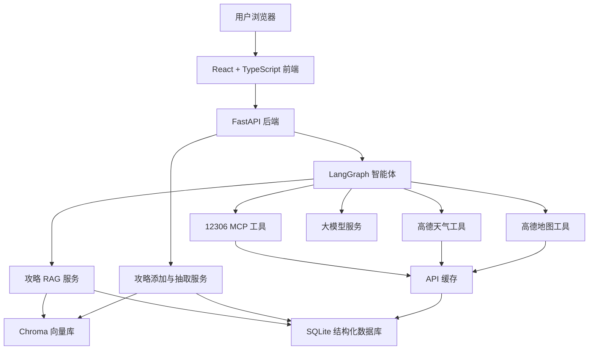
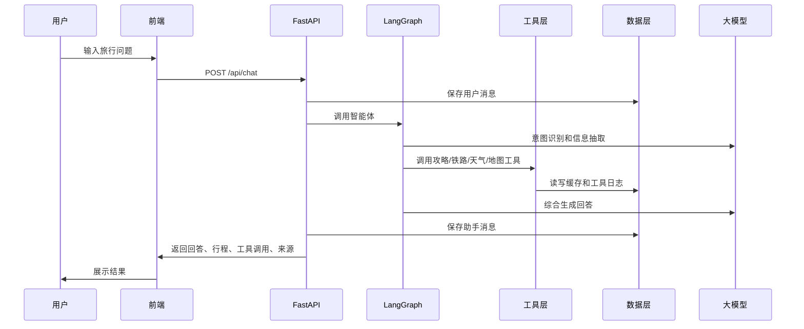
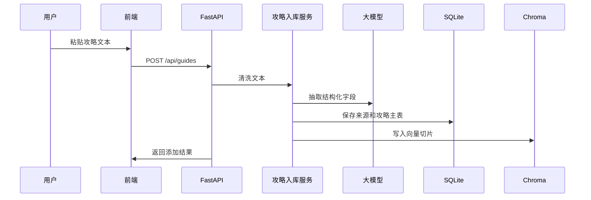

# 03. 整体架构设计

## 1. 架构目标

本项目架构需要满足：

- 后端稳定，外部接口失败可降级。
- 智能体流程清晰，能解释工具调用过程。
- 前后端分离，浏览器可直接使用。
- 数据库和向量库职责清晰。
- 后续可以扩展更多旅行工具。

## 2. 总体架构图



## 3. 分层设计

### 3.1 前端层

职责：

- 提供智能体聊天入口。
- 提供规划条件输入。
- 展示行程、天气、车次、地图结果。
- 展示工具调用链和攻略来源。
- 提供攻略添加入口。

不承担：

- 不直接调用第三方 API。
- 不直接访问数据库。
- 不持有 API Key。

### 3.2 API 层

职责：

- 接收前端请求。
- 参数校验。
- 调用智能体或业务服务。
- 统一返回格式。
- 处理异常、日志和 trace_id。

### 3.3 智能体层

职责：

- 理解用户意图。
- 决定调用哪些工具。
- 综合攻略、车次、天气、地图结果。
- 生成最终回答。
- 输出可解释过程。

### 3.4 工具服务层

职责：

- 封装 12306 MCP。
- 封装高德天气。
- 封装高德地图。
- 封装攻略 RAG。
- 封装攻略添加。

所有外部工具必须具备：

- 超时设置
- 错误捕获
- 日志记录
- 缓存策略
- 降级返回

### 3.5 数据层

职责：

- SQLite 保存结构化数据。
- Chroma 保存文本向量。
- `api_cache` 保存外部接口缓存。
- `tool_calls` 保存工具调用记录。

## 4. 后端目录建议

```text
backend/
  app/
    main.py
    api/
      chat.py
      guides.py
      tools.py
      health.py
    agents/
      graph.py
      nodes.py
      state.py
      prompts.py
      tools.py
    core/
      config.py
      logging.py
      response.py
      errors.py
    db/
      base.py
      session.py
      models.py
      repositories.py
    services/
      rag_service.py
      guide_ingest_service.py
      amap_service.py
      mcp_railway_service.py
      llm_service.py
      cache_service.py
    schemas/
      chat.py
      guides.py
      tools.py
    tests/
      test_health.py
      test_rag_service.py
      test_agent_route.py
  pyproject.toml
  .env.example
```

## 5. 前端目录建议

```text
frontend/
  src/
    app/
      App.tsx
      routes.tsx
    components/
      chat/
      planner/
      guides/
      tools/
      layout/
      ui/
    lib/
      api.ts
      types.ts
      format.ts
    styles/
      globals.css
      tokens.css
    main.tsx
  package.json
  vite.config.ts
  tailwind.config.ts
```

## 6. 请求流程

### 6.1 智能咨询流程



### 6.2 攻略添加流程



## 7. 运行架构

本地运行：

```text
start.bat
  ├─ 启动 FastAPI: http://127.0.0.1:8000
  ├─ 启动 Vite: http://127.0.0.1:5173
  └─ 自动打开浏览器
```

答辩推荐：

- 提前运行一次数据初始化。
- 提前生成部分缓存。
- 打开演示模式，确保外部接口失败时仍可演示。

## 8. 统一返回结构

所有后端接口使用统一响应：

```json
{
  "code": 0,
  "message": "ok",
  "data": {},
  "trace_id": "20260428-xxxx"
}
```

错误示例：

```json
{
  "code": 5002,
  "message": "天气服务暂时不可用，已返回缓存数据",
  "data": {
    "fallback": true
  },
  "trace_id": "20260428-xxxx"
}
```

## 9. 稳定性设计

| 风险 | 处理 |
| --- | --- |
| 大模型超时 | 返回部分工具结果和重试提示 |
| MCP 不可用 | 使用缓存或 Mock 数据 |
| 高德 API 超限 | 返回缓存并提示数据时间 |
| 向量库为空 | 返回引导添加攻略 |
| 用户问题不完整 | 智能体追问缺失条件 |
| 工具返回异常 | 写入日志，不中断整体回答 |

