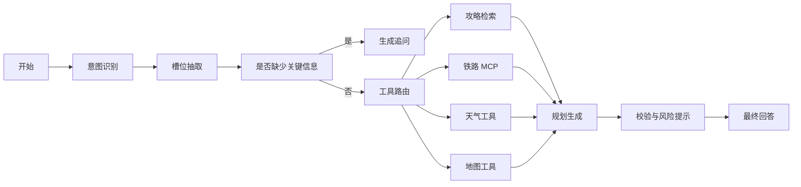

# 04. 智能体设计

## 1. 设计目标

智能体是本项目的核心。它不是一个简单的“调用大模型回答”的接口，而是一个多节点、多工具、可解释的旅行规划 Agent。

目标：

- 理解用户旅行意图。
- 自动补全出发地、目的地、日期、预算、偏好等槽位。
- 根据任务选择攻略、铁路、天气、地图工具。
- 综合多源信息生成个性化建议。
- 对不确定信息进行提示。
- 记录工具调用链，便于答辩展示。

## 2. 为什么使用 LangGraph

相比普通 Prompt 或单轮 Agent，LangGraph 更适合本项目：

- 可以显式定义节点和状态。
- 可以控制工具调用顺序。
- 可以根据意图走不同分支。
- 可以加入校验节点，减少幻觉。
- 可以记录每一步状态，便于调试和展示。

## 3. 智能体状态设计

建议定义 `TripAgentState`：

```python
class TripAgentState(TypedDict):
    conversation_id: str
    user_message: str
    intent: str
    slots: dict
    missing_slots: list[str]
    retrieved_guides: list[dict]
    railway_results: list[dict]
    weather_results: list[dict]
    map_results: list[dict]
    tool_calls: list[dict]
    draft_answer: str
    final_answer: str
    confidence: float
    warnings: list[str]
```

核心槽位：

| 字段 | 说明 |
| --- | --- |
| origin | 出发城市 |
| destination | 目的地 |
| date | 出行日期 |
| days | 旅行天数 |
| budget | 预算 |
| companions | 同行人 |
| style | 旅行风格，如轻松、美食、文化、自然 |
| transport | 交通偏好 |
| weather_sensitive | 是否受天气影响 |

## 4. 意图类型

| 意图 | 示例 | 主要工具 |
| --- | --- | --- |
| destination_recommendation | “上海出发两天去哪” | RAG、铁路、天气 |
| itinerary_planning | “南京三天两夜怎么玩” | RAG、地图、天气 |
| railway_query | “明天杭州到南京高铁” | 12306 MCP |
| weather_advice | “周末苏州下雨吗” | 天气、RAG |
| place_query | “夫子庙附近有什么” | 地图、RAG |
| add_guide | “帮我加入这份攻略” | 攻略入库工具 |
| general_qa | “独自旅行注意什么” | RAG |

## 5. LangGraph 节点设计



当前工程实现位置：

```text
backend/app/agents/graph.py      智能体入口，负责会话与图运行
backend/app/agents/nodes.py      LangGraph 节点函数
backend/app/agents/prompts.py    意图识别与规划提示词
backend/app/agents/state.py      TripAgentState 状态定义
backend/app/services/llm_service.py  OpenAI-compatible 大模型封装
```

实现策略：

- 已配置大模型时，优先使用 LLM 做意图识别、槽位抽取和最终规划表达。
- 未配置大模型或模型调用失败时，使用规则节点兜底，保证答辩演示稳定。
- 工具调用仍然由后端服务层控制，不让大模型直接访问第三方接口。

## 6. 节点职责

### 6.1 intent_node

职责：

- 判断用户意图。
- 给出意图置信度。
- 区分咨询、推荐、铁路、天气、地图、攻略添加。

输出：

```json
{
  "intent": "itinerary_planning",
  "confidence": 0.86
}
```

### 6.2 slot_node

职责：

- 从用户输入中抽取出发地、目的地、日期、天数、预算和偏好。
- 对日期进行标准化，例如“明天”“五一”“周末”。

### 6.3 clarification_node

职责：

- 当缺少必要信息时进行追问。
- 不为了完美信息无限追问，只追问真正影响结果的字段。

示例：

```text
我可以先帮你做推荐。还需要确认两个信息：你从哪个城市出发？预算大约是多少？
```

### 6.4 tool_router_node

职责：

- 根据意图和槽位决定调用工具。
- 为每个工具生成参数。
- 避免不必要的工具调用。

路由规则示例：

| 条件 | 调用工具 |
| --- | --- |
| 有目的地规划 | RAG + 天气 + 地图 |
| 有出发地和目的地 | 铁路 MCP |
| 问天气 | 天气 |
| 问附近或距离 | 地图 |
| 问攻略经验 | RAG |

### 6.5 retrieval_node

职责：

- 调用攻略 RAG 服务。
- 返回相关攻略片段、来源、城市和主题。

### 6.6 railway_node

职责：

- 通过 MCP 查询铁路信息。
- 只允许查询类工具。
- 对返回结果进行摘要。

安全边界：

- 不登录 12306。
- 不购票。
- 不抢票。
- 不处理验证码。
- 不保存身份证、手机号等敏感信息。

### 6.7 weather_node

职责：

- 查询目的地天气。
- 生成天气风险标签，例如“雨天”“高温”“低温”“大风”。

### 6.8 map_node

职责：

- 查询 POI。
- 查询地点经纬度。
- 估算景点之间路线耗时。

### 6.9 planner_node

职责：

- 综合攻略、铁路、天气、地图结果。
- 生成行程、推荐或咨询回答。
- 输出结构化结果供前端展示。

### 6.10 verifier_node

职责：

- 检查回答是否引用了来源。
- 检查实时数据是否注明时间。
- 检查是否出现不允许的行为，例如购票承诺。
- 生成风险提示。

## 7. 工具设计

### 7.1 guide_search_tool

输入：

```json
{
  "query": "南京三天两夜 美食 历史",
  "city": "南京",
  "top_k": 5
}
```

输出：

```json
{
  "items": [
    {
      "title": "南京三日游攻略",
      "chunk": "第一天建议...",
      "source_url": "https://...",
      "score": 0.82
    }
  ]
}
```

### 7.2 railway_query_tool

输入：

```json
{
  "origin": "杭州",
  "destination": "南京",
  "date": "2026-05-01"
}
```

输出：

```json
{
  "provider": "modelscope_12306_mcp",
  "trains": [],
  "fallback": false
}
```

### 7.3 weather_query_tool

输入：

```json
{
  "city": "苏州",
  "date": "2026-05-02"
}
```

输出：

```json
{
  "city": "苏州",
  "weather": "小雨",
  "temperature": "18-23",
  "risk_tags": ["雨天"]
}
```

### 7.4 map_route_tool

输入：

```json
{
  "origin": "苏州站",
  "destination": "拙政园",
  "city": "苏州"
}
```

输出：

```json
{
  "distance_meters": 6200,
  "duration_minutes": 28,
  "mode": "transit"
}
```

### 7.5 add_guide_tool

输入：

```json
{
  "title": "苏州两天一夜攻略",
  "content": "原始攻略文本",
  "source_url": "https://..."
}
```

输出：

```json
{
  "guide_id": 1,
  "city": "苏州",
  "chunks": 8,
  "status": "indexed"
}
```

## 8. Prompt 策略

### 8.1 系统角色

智能体角色：

```text
你是一个严谨的旅行规划智能体。你需要基于攻略知识库和工具结果回答问题。
不能编造实时车次、天气、地点距离。没有工具结果时必须说明不确定性。
```

### 8.2 回答格式

推荐回答结构：

```text
结论
推荐方案
行程安排
交通建议
天气与风险
预算估计
攻略来源
需要确认的信息
```

### 8.3 反幻觉要求

- 火车信息必须来自铁路工具。
- 天气必须来自天气工具或明确说明未查询。
- 地图距离必须来自地图工具或明确说明为经验估计。
- 攻略建议必须引用知识库来源。
- 不确定时优先说明限制，不假装确定。

## 9. 个性化推荐逻辑

推荐评分建议：

```text
总分 = 攻略匹配度 * 0.35
     + 交通便利度 * 0.25
     + 天气适宜度 * 0.20
     + 预算匹配度 * 0.10
     + 用户偏好匹配度 * 0.10
```

输出时不一定展示公式，但内部可以用该逻辑排序。

## 10. 工具调用日志

每次工具调用记录：

- conversation_id
- tool_name
- input_json
- output_summary
- status
- latency_ms
- error_message
- created_at

前端可以将这些记录展示为“智能体工作过程”。

## 11. 降级策略

| 情况 | 策略 |
| --- | --- |
| LLM 失败 | 返回工具结果摘要和重试提示 |
| RAG 无结果 | 提醒用户添加攻略或放宽条件 |
| MCP 失败 | 使用缓存或 Mock 并标记 |
| 高德失败 | 使用缓存并提示数据时间 |
| 地图地点歧义 | 追问用户确认具体地点 |
