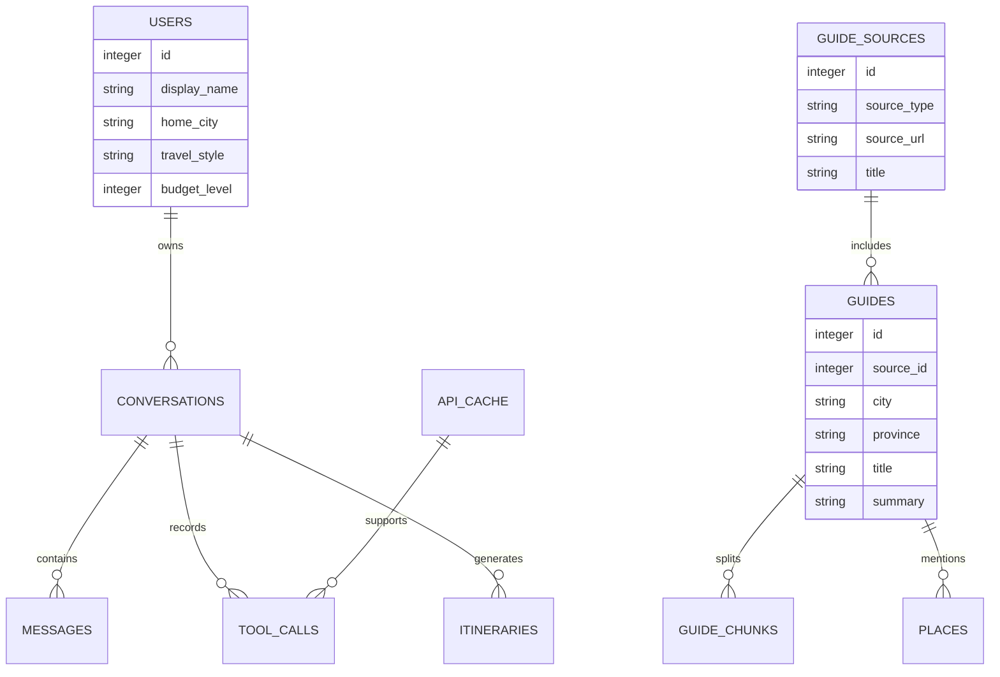

# 05. 数据库设计

## 1. 设计目标

数据库需要同时支撑：

- 攻略结构化管理。
- 攻略向量检索。
- 智能体会话历史。
- 工具调用日志。
- 外部接口缓存。
- 用户新增攻略。

课程项目阶段采用：

```text
SQLite + Chroma
```

SQLite 保存结构化数据，Chroma 保存攻略文本向量。

## 2. 数据库边界

SQLite 负责：

- 用户、会话、消息
- 攻略来源、攻略元数据、攻略切片元数据
- 工具调用日志
- API 缓存
- 生成行程

Chroma 负责：

- 攻略 chunk 的 embedding
- chunk 文本
- chunk 元数据索引

不建议把完整向量直接存在 SQLite 中，避免查询和维护复杂。

## 3. ER 图



## 4. 表结构设计

### 4.1 users

保存可选用户偏好。课程项目可默认使用匿名用户。

| 字段 | 类型 | 约束 | 说明 |
| --- | --- | --- | --- |
| id | INTEGER | PK | 用户 ID |
| display_name | TEXT | nullable | 显示名 |
| home_city | TEXT | nullable | 常用出发城市 |
| travel_style | TEXT | nullable | 偏好，如美食、自然、文化 |
| budget_level | INTEGER | default 2 | 预算等级，1 低，2 中，3 高 |
| created_at | DATETIME | not null | 创建时间 |
| updated_at | DATETIME | not null | 更新时间 |

### 4.2 conversations

保存会话。

| 字段 | 类型 | 约束 | 说明 |
| --- | --- | --- | --- |
| id | TEXT | PK | 会话 ID，建议 UUID |
| user_id | INTEGER | FK users.id | 用户 ID |
| title | TEXT | nullable | 会话标题 |
| status | TEXT | default active | 状态 |
| created_at | DATETIME | not null | 创建时间 |
| updated_at | DATETIME | not null | 更新时间 |

### 4.3 messages

保存聊天消息。

| 字段 | 类型 | 约束 | 说明 |
| --- | --- | --- | --- |
| id | INTEGER | PK | 消息 ID |
| conversation_id | TEXT | FK | 会话 ID |
| role | TEXT | not null | user、assistant、system |
| content | TEXT | not null | 消息内容 |
| structured_data | JSON | nullable | 行程、车次、天气等结构化结果 |
| created_at | DATETIME | not null | 创建时间 |

### 4.4 guide_sources

保存攻略来源。

| 字段 | 类型 | 约束 | 说明 |
| --- | --- | --- | --- |
| id | INTEGER | PK | 来源 ID |
| source_type | TEXT | not null | weibo、manual、link、demo |
| source_url | TEXT | nullable | 来源链接 |
| raw_url | TEXT | nullable | 原始链接，未跳转前 |
| resolved_url | TEXT | nullable | 解析后的最终链接 |
| category | TEXT | nullable | 来源分类，如江浙沪、川渝、火车经验 |
| crawl_status | TEXT | default indexed | indexed、pending、blocked、failed |
| title | TEXT | not null | 来源标题 |
| author | TEXT | nullable | 作者 |
| raw_text | TEXT | nullable | 原始文本 |
| license_note | TEXT | nullable | 来源说明 |
| created_at | DATETIME | not null | 创建时间 |

### 4.5 guides

保存攻略主信息。

| 字段 | 类型 | 约束 | 说明 |
| --- | --- | --- | --- |
| id | INTEGER | PK | 攻略 ID |
| source_id | INTEGER | FK | 来源 ID |
| title | TEXT | not null | 攻略标题 |
| city | TEXT | index | 城市 |
| province | TEXT | nullable | 省份 |
| region | TEXT | nullable | 区域，如江浙沪 |
| days | INTEGER | nullable | 推荐天数 |
| budget_min | INTEGER | nullable | 预算下限 |
| budget_max | INTEGER | nullable | 预算上限 |
| travel_style | TEXT | nullable | 风格标签，逗号分隔 |
| season | TEXT | nullable | 适合季节 |
| summary | TEXT | not null | 摘要 |
| status | TEXT | default active | active、archived |
| created_at | DATETIME | not null | 创建时间 |
| updated_at | DATETIME | not null | 更新时间 |

### 4.6 guide_chunks

保存攻略切片元数据。向量正文存在 Chroma 中，但 SQLite 保存映射关系。

| 字段 | 类型 | 约束 | 说明 |
| --- | --- | --- | --- |
| id | TEXT | PK | chunk ID，与 Chroma document id 一致 |
| guide_id | INTEGER | FK | 攻略 ID |
| chunk_index | INTEGER | not null | 切片序号 |
| content_hash | TEXT | unique | 内容哈希，去重用 |
| token_count | INTEGER | nullable | token 估算 |
| metadata_json | JSON | nullable | 城市、标签、来源等 |
| created_at | DATETIME | not null | 创建时间 |

### 4.7 places

保存攻略中提取出的地点。

| 字段 | 类型 | 约束 | 说明 |
| --- | --- | --- | --- |
| id | INTEGER | PK | 地点 ID |
| guide_id | INTEGER | FK | 攻略 ID |
| name | TEXT | not null | 地点名 |
| city | TEXT | index | 城市 |
| place_type | TEXT | nullable | scenic、food、station、hotel |
| address | TEXT | nullable | 地址 |
| amap_poi_id | TEXT | nullable | 高德 POI ID |
| longitude | REAL | nullable | 经度 |
| latitude | REAL | nullable | 纬度 |
| created_at | DATETIME | not null | 创建时间 |

### 4.8 tool_calls

保存智能体工具调用日志。

| 字段 | 类型 | 约束 | 说明 |
| --- | --- | --- | --- |
| id | INTEGER | PK | 调用 ID |
| conversation_id | TEXT | FK | 会话 ID |
| message_id | INTEGER | nullable | 关联消息 ID |
| tool_name | TEXT | not null | 工具名 |
| input_json | JSON | not null | 输入参数 |
| output_summary | TEXT | nullable | 输出摘要 |
| status | TEXT | not null | success、failed、fallback |
| latency_ms | INTEGER | nullable | 耗时 |
| error_message | TEXT | nullable | 错误信息 |
| created_at | DATETIME | not null | 创建时间 |

### 4.9 api_cache

保存外部接口缓存。

| 字段 | 类型 | 约束 | 说明 |
| --- | --- | --- | --- |
| id | INTEGER | PK | 缓存 ID |
| provider | TEXT | not null | amap、mcp_12306、llm |
| cache_key | TEXT | unique | 缓存键 |
| request_json | JSON | not null | 请求参数 |
| response_json | JSON | not null | 响应 |
| expires_at | DATETIME | not null | 过期时间 |
| created_at | DATETIME | not null | 创建时间 |

### 4.10 itineraries

保存生成过的行程。

| 字段 | 类型 | 约束 | 说明 |
| --- | --- | --- | --- |
| id | INTEGER | PK | 行程 ID |
| conversation_id | TEXT | FK | 会话 ID |
| title | TEXT | not null | 行程标题 |
| origin | TEXT | nullable | 出发城市 |
| destination | TEXT | not null | 目的地 |
| start_date | DATE | nullable | 开始日期 |
| days | INTEGER | nullable | 天数 |
| budget | INTEGER | nullable | 预算 |
| plan_json | JSON | not null | 分天行程 |
| sources_json | JSON | nullable | 来源 |
| created_at | DATETIME | not null | 创建时间 |

## 5. Chroma Collection 设计

Collection 名称：

```text
travel_guides
```

Document ID：

```text
guide-{guide_id}-chunk-{chunk_index}
```

Metadata：

```json
{
  "guide_id": 1,
  "source_id": 1,
  "title": "南京三天两夜攻略",
  "city": "南京",
  "province": "江苏",
  "region": "江浙沪",
  "travel_style": ["文化", "美食"],
  "source_url": "https://..."
}
```

## 6. 索引建议

SQLite 索引：

```text
idx_guides_city
idx_guides_region
idx_guides_days
idx_places_city_name
idx_messages_conversation_id
idx_tool_calls_conversation_id
idx_api_cache_provider_key
idx_guide_chunks_guide_id
```

## 7. 数据生命周期

| 数据 | 生命周期 |
| --- | --- |
| 攻略来源 | 长期保存 |
| 攻略切片 | 随攻略更新重建 |
| 会话消息 | 长期保存，可手动清理 |
| 工具调用日志 | 答辩和调试阶段长期保存 |
| 天气缓存 | 1 到 6 小时 |
| 地图缓存 | 7 到 30 天 |
| 车次缓存 | 5 到 30 分钟 |

## 8. 数据初始化

项目应提供初始化脚本：

```text
backend/app/scripts/init_db.py
backend/app/scripts/seed_guides.py
```

初始化内容：

- 建表。
- 写入 demo 用户。
- 写入示例攻略来源。
- 构建初始 Chroma collection。
- 写入示例缓存，便于离线演示。
