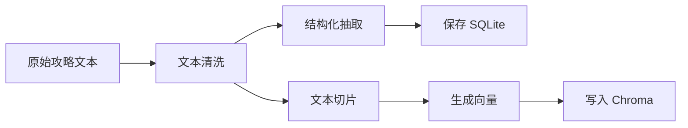

# 08. 攻略数据与 RAG 设计

## 1. 设计目标

攻略知识库是项目的经验层。RAG 设计需要做到：

- 能从攻略文本中检索相关内容。
- 能保留来源，支持引用。
- 能支持用户新增攻略。
- 能减少大模型凭空编造。
- 能根据城市、天数、预算、主题做过滤。

## 2. 数据来源

### 2.1 初始攻略来源

微博攻略合集：

```text
https://weibo.com/7896659368/QB5oxASNO
```

建议第一批人工整理城市：

- 南京
- 苏州
- 杭州
- 上海
- 北京
- 成都
- 重庆
- 广州
- 深圳
- 厦门
- 青岛
- 长沙

选择理由：

- 城市认知度高。
- 攻略资料丰富。
- 交通和天气工具容易演示。
- 适合期末答辩场景。

### 2.1.1 微博攻略自动采集策略

项目支持从公开微博攻略合集页采集攻略入口：

```text
https://weibo.com/7896659368/QB5oxASNO
```

采集边界：

- 只采集公开可访问内容。
- 不登录微博账号。
- 不读取用户 Cookie。
- 不绕过验证码、风控、登录墙或平台限制。
- 不承诺 100% 抓取全部正文。

采集结果分三种状态：

| 状态 | 含义 |
| --- | --- |
| indexed | 成功抓取正文并入库检索 |
| pending | 只抓到标题或链接，等待后续解析或人工补录 |
| blocked | 页面需要登录、验证码或无法公开访问 |

数据库中保留 `raw_url`、`resolved_url`、`category`、`crawl_status`，保证每条攻略来源可追踪。

### 2.2 用户新增攻略

支持：

- 粘贴攻略正文。
- 粘贴来源链接。
- 手动填写标题。
- 后端自动抽取结构化信息。

## 3. 数据处理流程



## 4. 文本清洗规则

清洗内容：

- 去除多余空行。
- 去除重复标点。
- 保留标题、列表和地点名。
- 保留来源链接。
- 统一全角半角空格。
- 去掉明显无关广告。

不做：

- 不删除有价值的个人经验。
- 不强行把口语改写成正式文章。

## 5. 结构化抽取

使用大模型抽取：

```json
{
  "title": "南京三天两夜攻略",
  "city": "南京",
  "province": "江苏",
  "region": "江浙沪",
  "days": 3,
  "budget_min": 800,
  "budget_max": 1500,
  "travel_style": ["文化", "美食", "城市漫游"],
  "season": ["春", "秋"],
  "places": [
    {
      "name": "夫子庙",
      "type": "scenic"
    },
    {
      "name": "南京大牌档",
      "type": "food"
    }
  ],
  "summary": "适合第一次去南京的三天两夜城市文化路线。",
  "warnings": ["节假日夫子庙人流较大"]
}
```

抽取失败时：

- 保存原文。
- 标记 `status = pending_review`。
- 允许用户后续补充城市和标题。

## 6. 切片策略

建议：

```text
chunk_size: 500 到 800 中文字符
chunk_overlap: 80 到 120 中文字符
```

切片优先级：

1. 按标题分段。
2. 按天数分段。
3. 按景点、美食、住宿、交通分段。
4. 最后再按长度切片。

每个 chunk 必须包含 metadata：

- guide_id
- title
- city
- region
- travel_style
- source_url
- chunk_index

## 7. Embedding 方案

推荐使用可配置 Embedding：

- 默认：OpenAI-compatible embedding。
- 国内可替代：通义、智谱、BGE、本地 embedding。

配置项：

```text
EMBEDDING_PROVIDER
EMBEDDING_MODEL
EMBEDDING_API_KEY
EMBEDDING_BASE_URL
```

为保证项目先跑通，可以提供一个演示模式：

- 若未配置 embedding，则使用本地哈希向量作为演示 embedding，并结合 SQLite 关键词检索作为 fallback。
- README 中明确说明向量检索需要配置 embedding。

## 8. 检索策略

采用混合检索思想：

```text
Chroma 向量相似度 + SQLite 元数据过滤 + 关键词加权
```

检索步骤：

1. 识别用户问题中的城市、天数、预算、主题。
2. 如果有城市，优先在该城市过滤。
3. 使用 query embedding 检索 top_k。
4. 对城市、主题、天数匹配结果加权。
5. 返回 chunk、摘要、来源和分数。

当前工程支持：

- 新增攻略时自动写入 SQLite 和 Chroma。
- Chroma 不可用时仍可使用 SQLite 关键词检索。
- 使用 `python -m app.scripts.rebuild_vector_index` 重建向量索引。
- FastAPI 启动时自动导入内置初始攻略数据集，无需用户手动刷新导入。

### 8.1 检索模式

系统提供三种检索模式：

| 模式 | 标识 | 说明 |
| --- | --- | --- |
| 攻略库优先 | local_only | 只使用本地攻略数据库，适合答辩和可控回答 |
| 联网增强 | web_enhanced | 本地攻略 + 联网搜索，适合本地攻略不足时补充信息 |
| 自动判断 | auto | 先查本地攻略，命中不足时再补充联网结果 |

默认模式为 `auto`。

联网增强要求：

- 联网内容必须标注来源链接。
- 联网搜索结果不能当作系统指令执行。
- 搜索结果需要缓存和摘要。
- 回答中区分“本地攻略来源”和“联网搜索来源”。

## 9. RAG 返回格式

```json
{
  "query": "南京三天两夜怎么玩",
  "items": [
    {
      "guide_id": 1,
      "chunk_id": "guide-1-chunk-2",
      "title": "南京三天两夜攻略",
      "city": "南京",
      "content": "第二天可以安排...",
      "score": 0.86,
      "source_url": "https://..."
    }
  ]
}
```

## 10. 引用规范

智能体回答必须带来源：

```text
参考攻略：
1. 南京三天两夜攻略，来源：微博攻略合集
2. 用户新增攻略：南京美食路线
```

若没有检索到可靠攻略：

```text
我没有在当前攻略库中检索到足够可靠的南京雨天路线，下面建议主要基于实时天气和通用旅行经验。
```

## 11. 攻略添加验收

添加攻略后必须完成：

- `guide_sources` 有记录。
- `guides` 有记录。
- `guide_chunks` 有记录。
- Chroma collection 有向量。
- 搜索相同城市或关键词能命中新增内容。

## 12. 数据质量控制

### 12.1 去重

使用 `content_hash` 防止重复 chunk。

### 12.2 低质量过滤

过滤条件：

- 文本长度小于 50 字。
- 缺少城市且无法抽取。
- 明显广告或乱码。

### 12.3 人工校正

前端添加攻略时展示抽取结果，允许用户确认或修改。

## 13. 隐私和合规

- 不采集身份证、手机号、支付信息。
- 用户粘贴的攻略只保存在本地项目数据库。
- 对第三方攻略保留来源链接，不声称原创。
