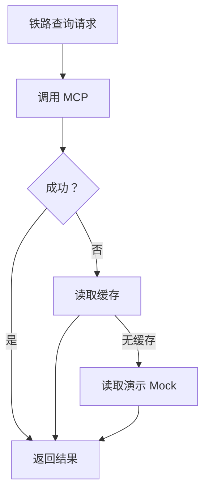

# 09. 外部集成设计

## 1. 集成目标

项目需要集成四类外部能力：

- 大模型服务
- ModelScope 12306 MCP
- 高德天气 API
- 高德地图 API
- 可选联网搜索工具

所有外部集成都必须经过后端服务层封装，前端不直接访问外部接口。

## 2. 配置文件

`.env.example` 应包含：

```text
APP_ENV=development
APP_DEBUG=true

LLM_PROVIDER=deepseek
LLM_MODEL=deepseek-v4-flash
LLM_API_KEY=
LLM_BASE_URL=https://api.deepseek.com

EMBEDDING_PROVIDER=openai_compatible
EMBEDDING_MODEL=
EMBEDDING_API_KEY=
EMBEDDING_BASE_URL=

AMAP_API_KEY=

MCP_12306_ENABLED=true
MCP_12306_CONFIG_PATH=./mcp_servers.json

DATABASE_URL=sqlite:///./data/tripsage.db
CHROMA_PERSIST_DIR=./data/chroma

DEMO_MODE=false

WEB_SEARCH_ENABLED=true
WEB_SEARCH_PROVIDER=duckduckgo
WEB_SEARCH_API_KEY=
WEB_SEARCH_TIMEOUT_SECONDS=10
WEB_SEARCH_CACHE_TTL_MINUTES=60
```

`mcp_servers.example.json` 应包含示例结构，真实配置由用户根据 ModelScope 页面说明填写。

## 3. 大模型集成

### 3.1 调用方式

使用 OpenAI-compatible client 封装：

```text
services/llm_service.py
```

接口：

- `chat(messages, temperature, response_format)`
- `extract_json(prompt, schema)`
- `summarize(text)`

### 3.2 模型职责

| 场景 | 模型职责 |
| --- | --- |
| 意图识别 | 判断用户想做什么 |
| 槽位抽取 | 提取城市、日期、预算 |
| 攻略抽取 | 从新增攻略中抽取结构化字段 |
| 结果生成 | 综合工具结果生成回答 |
| 校验 | 检查缺失、风险和不确定性 |

### 3.3 失败处理

- 超时后返回工具结果摘要。
- JSON 抽取失败时重试一次。
- 仍失败则标记为 `pending_review`。

## 4. 12306 MCP 集成

### 4.1 目标

通过 ModelScope 12306 MCP 提供铁路查询能力。

来源：

```text
https://www.modelscope.cn/mcp/servers/A15570082312/12306
```

### 4.2 封装服务

文件：

```text
services/mcp_railway_service.py
```

对外方法：

```python
async def query_trains(origin: str, destination: str, date: str) -> RailwayQueryResult:
    ...
```

### 4.3 LangGraph 工具

工具名：

```text
railway_query_tool
```

描述：

```text
查询两个城市在指定日期的铁路车次和余票信息，只用于出行参考。
```

### 4.4 allowlist

只允许工具名包含：

- query
- train
- station
- ticket
- transfer
- price
- route
- stop

禁止：

- login
- order
- pay
- captcha
- grab
- passenger
- submit
- cancel

实际实现时应根据 MCP 暴露的工具名做白名单映射。

### 4.6 live 安全开关

默认配置：

```text
MCP_12306_ALLOW_LIVE=false
```

只有显式改为 `true` 后，后端才会启动外部 MCP 服务并发现工具。这样可以避免项目启动时自动运行未确认的第三方命令。

### 4.5 降级



## 5. 高德天气集成

### 5.1 API

参考：

```text
https://lbs.amap.com/api/webservice/guide/api-advanced/weatherinfo
```

服务文件：

```text
services/amap_service.py
```

方法：

```python
async def get_weather(city: str, extensions: str = "base") -> WeatherResult:
    ...
```

### 5.2 缓存

天气缓存建议：

```text
base 实况天气：1 小时
all 预报天气：3 到 6 小时
```

### 5.3 风险标签

天气结果转换为标签：

| 条件 | 标签 |
| --- | --- |
| 雨、阵雨、雷阵雨 | 雨天 |
| 温度高于 33 | 高温 |
| 温度低于 5 | 低温 |
| 风力较大 | 大风 |
| 空气质量较差 | 空气风险 |

## 6. 高德地图集成

### 6.1 POI 搜索

参考：

```text
https://lbs.amap.com/api/webservice/guide/api-advanced/search
```

用途：

- 查询景点。
- 查询餐厅。
- 查询车站。
- 查询地点经纬度。

### 6.2 地理编码

参考：

```text
https://lbs.amap.com/api/webservice/guide/api/georegeo
```

用途：

- 将中文地址解析为经纬度。
- 将城市解析为 adcode，供天气接口使用。
- 在路径规划前解析起终点坐标。

### 6.3 路径规划

参考：

```text
https://lbs.amap.com/api/webservice/guide/api/direction
```

用途：

- 估算两个景点之间距离。
- 估算从车站到景点耗时。
- 判断行程是否过密。

### 6.4 地点歧义处理

如果 POI 返回多个结果：

- 优先同城市。
- 优先评分或行政区匹配。
- 仍有歧义则让智能体追问。

示例：

```text
“西湖”可能指多个地点。我猜你指的是杭州西湖，如果不是，请告诉我具体城市。
```

## 7. 缓存策略

缓存键格式：

```text
provider:operation:hash(params)
```

示例：

```text
amap:weather:suzhou:2026-05-01
amap:route:suzhou_station:zhuozhengyuan
mcp12306:train:hangzhou:nanjing:2026-05-01
```

## 8. 超时策略

| 服务 | 超时 |
| --- | --- |
| LLM | 60 秒 |
| Embedding | 30 秒 |
| 高德天气 | 8 秒 |
| 高德地图 | 8 秒 |
| 12306 MCP | 20 秒 |
| 联网搜索 | 10 秒 |

## 9. 日志策略

每次外部调用记录：

- trace_id
- provider
- operation
- sanitized_request
- status
- latency_ms
- cache_hit
- error_message

注意：

- 不记录 API Key。
- 不记录敏感个人信息。
- 错误堆栈写入本地日志，不直接返回前端。

## 10. 演示模式

`.env` 中设置：

```text
DEMO_MODE=true
```

演示模式行为：

- 优先使用真实接口。
- 失败时使用本地 Mock。
- 前端显示“演示兜底数据”标签。

这样可以保证答辩当天网络或接口异常时项目仍能完整演示。

## 11. 联网搜索集成

联网搜索作为可选工具，不直接让大模型自由浏览，而是由后端封装成受控工具：

```text
services/web_search_service.py
```

工具职责：

- 根据用户问题生成搜索查询。
- 返回标题、摘要、链接、域名和 provider。
- 对结果做 SQLite 缓存。
- 过滤本机、内网、脚本协议和非 HTTP/HTTPS 链接。
- DuckDuckGo 不可用时自动降级到 Bing HTML。

安全要求：

- 网页内容只作为第三方资料，不作为系统指令。
- 不读取用户浏览记录、Cookie 或本地隐私数据。
- 不自动打开不可信短链。
- 回答必须标注联网来源。

API：

```text
GET  /api/web-search/ping
POST /api/tools/web-search
```

智能体策略：

- `local_only`：不调用联网搜索。
- `web_enhanced`：强制使用联网搜索补充资料。
- `auto`：本地攻略命中少于 2 条时自动联网。
